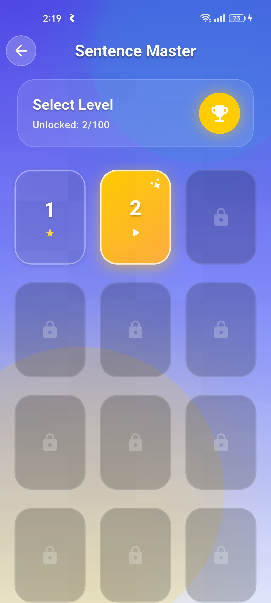
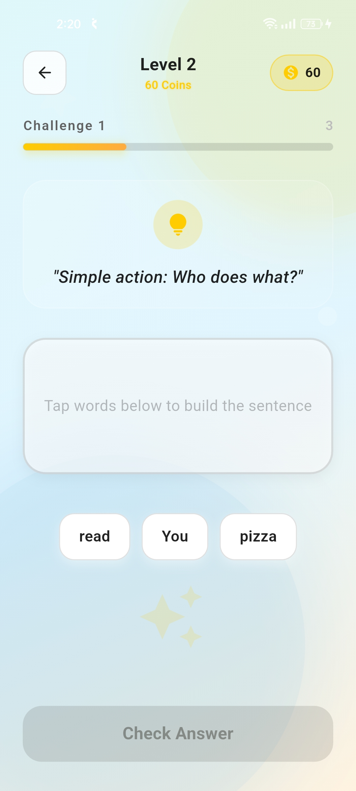
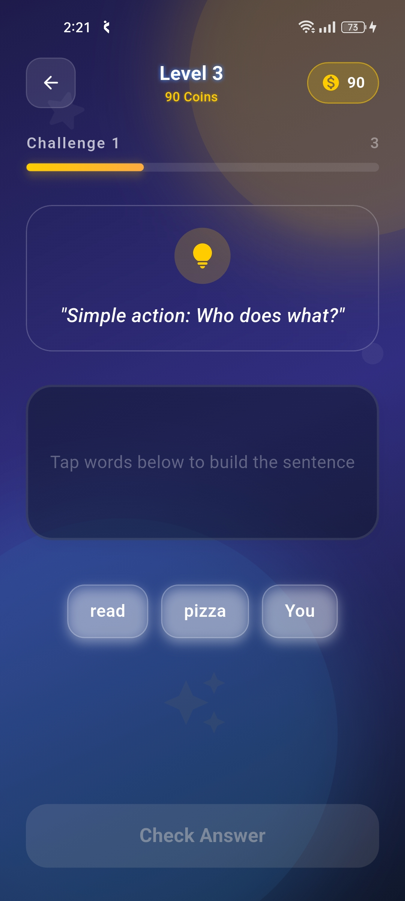
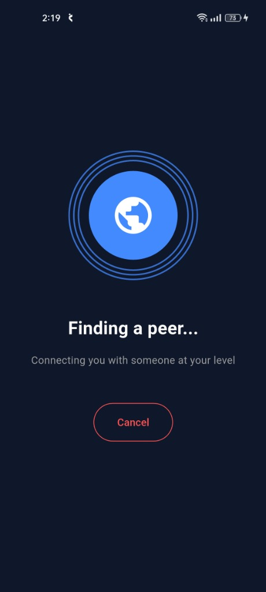
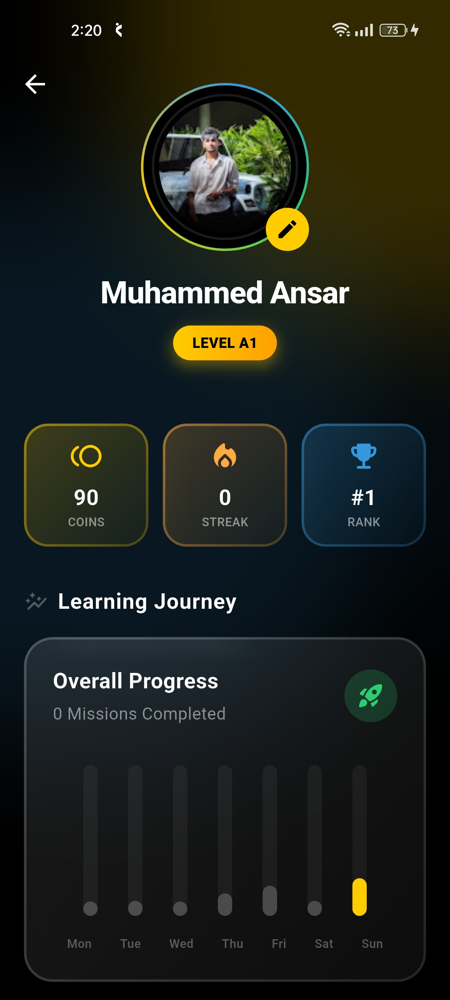
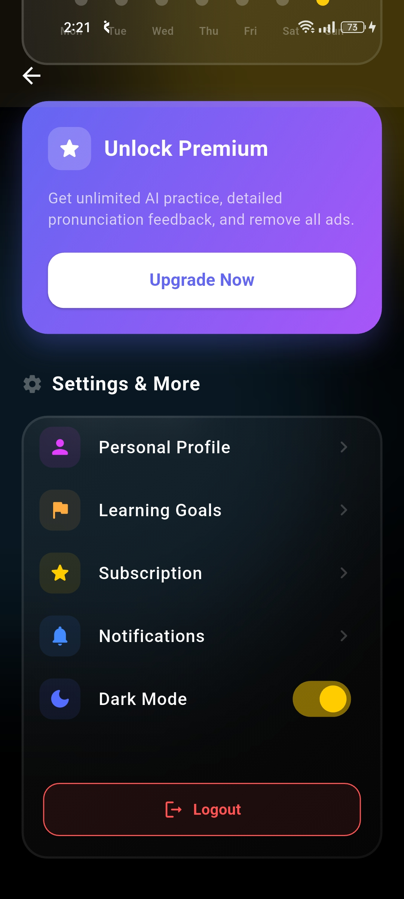

# Fluentify 🎓 - Advanced Language Learning


**Fluentify** is a professional-grade language learning platform. It is built using **Clean Architecture** principles and **BLoC State Management** to ensure high scalability, maintainability, and testability.

---

## 📸 Project Showcase

### 🧩 Sentence Master Interface
Practice grammar and sentence building with an intuitive drag-and-drop interface.

| Level Selection | Challenge Interface | Dark Mode Challenge |
| :---: | :---: | :---: |
|  |  |  |

### 👥 Peer Interaction & Social
Connect with fellow learners and track your progress on a comprehensive dashboard.

| Finding a Peer | Profile Dashboard | Settings & Dark Mode |
| :---: | :---: | :---: |
|  |  |  |

---

## 🏗 Architecture & State Management

The project strictly follows **Clean Architecture** to decouple business logic from the UI and external data sources.

### 📱 Frontend (Flutter)
- **State Management**: [BLoC (Business Logic Component)](https://bloclibrary.dev/)
- **Architecture**: Domain-Driven Design (Clean Architecture)
  - **Data Layer**: Repositories implementations, Data sources (Local/Remote), and Models (DTOs).
  - **Domain Layer**: Entities, Repositories interfaces, and Use Cases.
  - **Presentation Layer**: BLoCs, Pages, and Widgets.

### 📂 Folder Structure Example (`lib/features/auth`)
```bash
auth/
├── data/               # Implementation of repositories & data sources
│   ├── datasources/
│   ├── models/
│   └── repositories/
├── domain/             # Business logic & contracts
│   ├── entities/
│   ├── repositories/
│   └── usecases/
└── presentation/       # UI & State management
    ├── bloc/
    ├── pages/
    └── widgets/
```

### 🛠 Backend (NestJS)
- **Framework**: NestJS (Scalable Node.js)
- **Database**: PostgreSQL with TypeORM
- **Pattern**: Controller-Service-Repository pattern for modularity.

---

## 🔐 Authentication & Security

Fluentify provides multiple secure authentication methods:
- **Email/Password**: Traditional authentication with data securely stored in **PostgreSQL**.
- **Google Sign-In**: Seamless OAuth2 integration using Firebase Authentication.
- **JWT Security**: All backend requests are protected by JSON Web Tokens.

---

## 🚀 Core Features

- **Adaptive Learning**: 100+ levels that scale with your progress.
- **Smart Peer Matching**: Instantly connect with users for real-time practice via Agora.
- **AI Feedback**: Detailed pronunciation and grammar analysis using AI models.
- **Responsive UI**: Built with `flutter_screenutil` for a perfect look on all screen sizes.

---

## 🏁 Execution Guide

### 1. Backend (Local)
```bash
cd fluentify_backend
npm install
npm run start:dev
```

### 2. Tunneling (For Mobile Testing)
```bash
npx tunnelmole 3000
```

### 3. Mobile App
```bash
cd fluentify_frontend
flutter pub get
flutter run
```

---

## 📄 License
Project is licensed under the MIT License.
