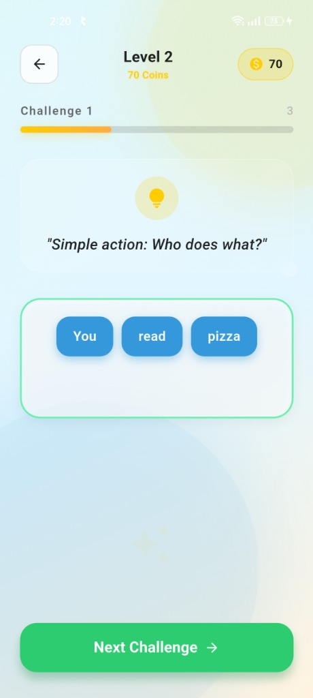
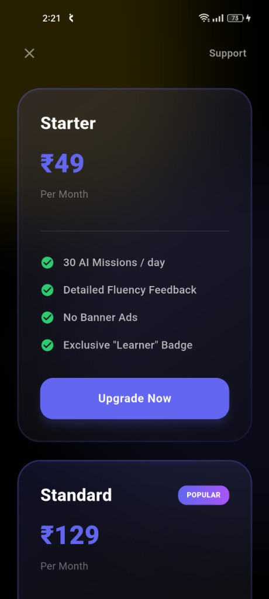

# Fluentify 🎓 - Language Learning Platform


**Fluentify** is an advanced language learning application designed to break communication barriers through AI-driven lessons and peer-to-peer interaction. 

> [!IMPORTANT]
> **Project Status: Building Stage.** This project is currently under active development. Core features like Sentence Master and Peer Finding are being refined.

---

## 📸 Screenshots

| Sentence Master Levels | Challenge Interface | Peer Finding |
| :---: | :---: | :---: |
|  |  |  |

| Challenge Success | Premium Subscription |
| :---: | :---: |
|  |  |

---

## 🚀 Key Features

### 🧩 **Sentence Master**
- **100+ Levels**: Progress through structured levels of increasing difficulty.
- **Interactive Challenges**: Build sentences from word blocks to master grammar.
- **Instant Feedback**: Get immediate results and earn coins for correct answers.

### 👥 **Peer Learning**
- **Live Connection**: Find and connect with other learners at your skill level.
- **Real-time Practice**: Practice speaking and listening in a supportive environment.

### 💎 **Subscription Plans**
- **Starter (₹49/mo)**: 30 AI missions per day, fluency feedback, and learner badge.
- **Standard (₹129/mo)**: Popular choice for serious learners.

---

## 🛠 Technology Stack

| Component | Technology | Description |
|-----------|------------|-------------|
| **Mobile App** | [Flutter](https://flutter.dev/) | Cross-platform UI with ScreenUtil for responsiveness |
| **Backend API** | [NestJS](https://nestjs.com/) | Modular Node.js framework for scalable APIs |
| **Database** | [PostgreSQL](https://www.postgresql.org/) | Relational database managed with TypeORM |
| **Real-time** | [Agora](https://www.agora.io/) | Powering peer-to-peer audio/video communication |
| **Auth** | [Firebase](https://firebase.google.com/) | Secure Google Sign-In and token verification |
| **Tunnel** | [Tunnelmole](https://tunnelmole.com/) | Secure public URLs for local development testing |

---

## 🏁 How to Run Locally

### 1. Prerequisites
- Flutter SDK (Latest Stable)
- Node.js (v20+)
- PostgreSQL Database
- Tunnelmole (for testing on real devices)

### 2. Backend Setup
```bash
cd fluentify_backend
npm install
# Configure your .env file with DB and Firebase credentials
npm run start:dev
```

### 3. Network Tunnel (Optional for real device)
```bash
npx tunnelmole 3000
```
*Update `apiBaseUrl` in `lib/core/constants/app_constants.dart` with the tunnel URL.*

### 4. Frontend Setup
```bash
cd fluentify_frontend
flutter pub get
flutter run
```

---

## 📂 Project Structure

```bash
fluentify/
├── fluentify_frontend/     # Flutter mobile application
├── fluentify_backend/      # NestJS server application
└── assets/screenshots/     # Project visuals and documentation images
```

---

## 📄 License

This project is licensed under the MIT License - see the [LICENSE](LICENSE) file for details.
