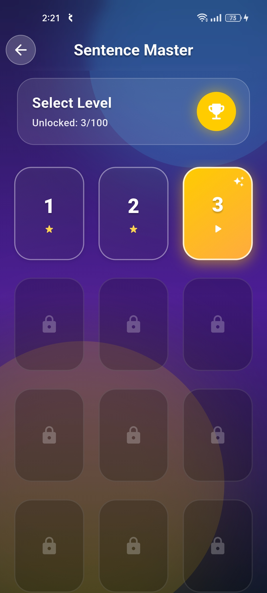
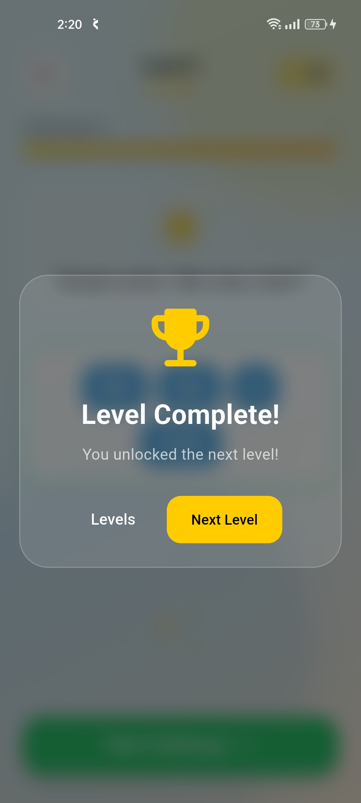
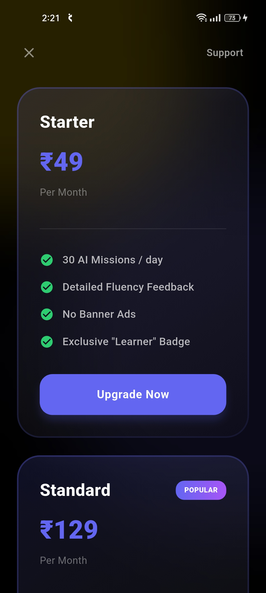
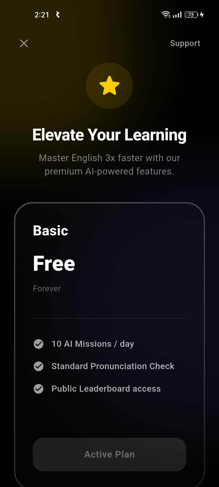

# Fluentify 🎓 — The Future of Language Learning


**Fluentify** is an elite, full-stack language learning ecosystem designed to accelerate fluency. By bridging the gap between passive learning and active conversation, Fluentify uses AI-driven challenges and real-time peer matching to create an immersive practice environment available 24/7.

---

## 📽️ Project Showcase

### 🧩 The "Sentence Master" Experience
Master grammar and syntax through interactive block-building exercises. Featuring over 100+ levels of progressive difficulty.

| Level Selection (Light) | Level Selection (Dark) | Challenge UI | Dark Interface |
| :---: | :---: | :---: | :---: |
|  |  |  |  |

### 👥 Social & Real-time Collaboration
Don't just learn alone. Connect with peers at your exact skill level for live practice sessions.

| Finding a Peer | Profile Dashboard | Settings & Customization |
| :---: | :---: | :---: |
|  |  |  |

### 🏆 Progress & Rewards
Gamified milestones to keep you motivated.

| Milestone Reached | Premium Rewards | Flexible Plans |
| :---: | :---: | :---: |
|  |  |  |

---

## 🚀 Vision & Key Features

Fluentify isn't just an app; it's a personal language coach in your pocket.

### 1. **Adaptive AI Learning Path**
- **100+ Progressive Levels**: Content that evolves with your skill set.
- **Immediate Feedback**: AI analysis of your sentence constructions and pronunciation.
- **Coin-based Rewards**: Earn currency through accuracy to unlock new features.

### 2. **Real-time Peer Matching**
- **Agora Integration**: Ultra-low latency audio/video connections.
- **Skill-based Matchmaking**: You are always paired with someone who challenges you correctly.
- **Privacy First**: Secure, moderated environments for safe practice.

### 3. **Premium Ecosystem**
- **Subscription Model**: Tiered access (Basic, Starter, Standard).
- **AI Missions**: Daily limits on free tiers to maintain system scalability.
- **Exclusive Badges**: Showcase your learner status in the global community.

---

## 🏗️ Technical Architecture

The project is engineered for long-term scalability and team collaboration.

### **Frontend: Flutter Clean Architecture**
We follow the **Domain-Driven Design (DDD)** approach to isolate business logic from UI changes.
- **State Management**: **BLoC (Business Logic Component)** for predictable state transitions.
- **Responsiveness**: `flutter_screenutil` for multi-device support.
- **Dependency Injection**: `get_it` and `injectable` for decoupling services.

### **Backend: NestJS Modular System**
- **Language**: TypeScript for type-safe server logic.
- **Architecture**: Modular structure (one module per domain).
- **ORM**: TypeORM for high-performance database interactions.
- **Database**: **PostgreSQL** for robust data persistence.

---

## 🔐 Security & Identity

- **Traditional Auth**: Email/Password authentication with hashed data in PostgreSQL.
- **OAuth 2.0**: Seamless **Google Sign-In** integration.
- **JWT Authorization**: All private routes protected by signed JSON Web Tokens.
- **Firebase Admin**: Server-side token validation for foolproof security.

---

## 📂 Detailed Directory Map

### **📱 Flutter (Frontend)**
```bash
lib/
├── core/                # Global Core Layer
│   ├── constants/       # API URLs, Asset paths, Keys
│   ├── di/              # Service Locator (GetIt) setup
│   ├── error/           # Centralized Failure handling
│   ├── network/         # Dio client & Interceptor config
│   ├── services/        # Audio, Storage, & Notification services
│   └── theme/           # Design System & Colors
├── features/            # Independent Feature Modules
│   └── [feature_name]/  # (e.g., auth, peer, game, user)
│       ├── data/        # Data Layer (Api calls, Local DB, Models)
│       ├── domain/      # Domain Layer (UseCases, Entity, Repo Interface)
│       └── presentation/# UI Layer (BLoCs, Pages, Widgets)
└── main.dart            # App entry point
```

### **🛠️ NestJS (Backend)**
```bash
src/
├── modules/             # Business Logic Domains
│   ├── auth/            # Auth, JWT, Google Logic
│   ├── peer/            # Matchmaking & Gateway logic
│   ├── user/            # Profile & Leaderboard
│   └── [others]/        # Payment, Mission, Chat
├── shared/              # Reusable Logic (Firebase, AI Services)
├── common/              # Global Guards, Decorators, & Filters
└── database/            # Migrations & Entity Schema
```

---

## 🏁 Getting the Project Running

### 1. **Local Backend**
```bash
cd fluentify_backend
npm install
# Configure your .env (DB_NAME, FIREBASE_KEYS, etc.)
npm run start:dev
```

### 2. **Mobile Bridge (Tunnelmole)**
Required if testing on a real physical Android/iOS device.
```bash
npx tunnelmole 3000
```
*Update `lib/core/constants/app_constants.dart` with the generated URL.*

### 3. **Flutter App**
```bash
cd fluentify_frontend
flutter pub get
flutter run
```

---

## 📈 Roadmap & Current Stage
**Fluentify is currently in the late "Building Stage".**
- [x] Clean Architecture Setup
- [x] Multi-provider Authentication
- [x] Level/Mission Foundation
- [x] UI/UX Design System (Light/Dark)
- [ ] Advanced AI Pronunciation Feedback (Upcoming)
- [ ] Global Leaderboard Competitions (In Progress)

---

## 🤝 Contributing
Contributions are what make the open-source community such an amazing place to learn, inspire, and create. Any contributions you make are **greatly appreciated**.

## 📄 License
Distributed under the **MIT License**. See `LICENSE` for more information.

---
*Developed with ❤️ by the Fluentify Team.*
